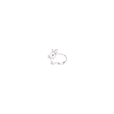

# Setting up
These crosshairs are meant to be used for ***Standalone Launcher***, which you can either [***install with my tool***](https://github.com/exserta/KoGaMa/tree/main/Standalone/LauncherInstaller) or download yourself.  
Resolutions of these crosshairs are ***128x128*** each for compatibility.

After conducting the first step and installing launcher for kogama, pick the crosshair you like most from [***my collection***](https://github.com/exserta/KoGaMa/tree/main/Standalone/CustomCrosshair/Crosshairs) or make your own that fits the proper resolution.  

Preview Crosshairs

 
  
Credits for these crosshairs goes to ***Sorry*** & ***Snowie***
  
<table>
  <tr>
    <td align="center">
      <h3>Bunny</h3>
      
    </td>
    <td align="center">
      <h3>LessThan3</h3>
      
    </td>
    <td align="center">
      <h3>Star Sign</h3>
      
    </td>
    <td align="center">
      <h3>Dino</h3>
      
    </td>
  </tr>
  <tr>
    <td align="center">
      <h3>Dot</h3>
      
    </td>    
    <td align="center">
      <h3>Plus Sign</h3>
      
    </td>
        <td align="center">
      <h3>Tight Plus Sign</h3>
      
    </td>
  </tr>
</table>

 

After picking, or creating a crosshair that you genuinely like the design of, you'll need to grab [***nesrak1/UABEA***](https://github.com/nesrak1/UABEA) to implement our crosshair within the `.assets` file.

For further steps and sanity of us both, please go ahead and watch [***this scuffed guide***](https://www.youtube.com/watch?v=nFAL97LQGKk)

